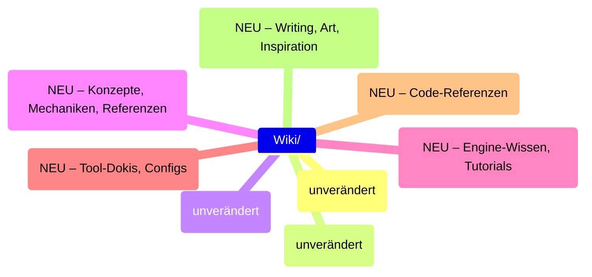

# Vault-Architektur: Reorganisations-Plan

> Erstellt nach vollständiger Analyse aller 22 Markdown-Dateien, 4 Canvas-Dateien,
> 2 Dataview-Base-Dateien und der gesamten Ordnerstruktur.
> Stand: 16. Juli 2026

---

## Teil 1: Status Quo – Inventar & Analyse

### 1.1 Vault-Inventar

```
AllMyNotes/
├── README.md                       # Root-Landing: GIF, Skills, Projekt-Tabelle, Soziales
├── AGENT.md                        # Von mir erstellt (wird aktualisiert)
│
├── Excalidraw/                     # Plugin-generiert (tags: [excalidraw])
│   ├── Drawing 2026-07-16 13.24.33.excalidraw.md
│   └── Drawing 2026-07-16 14.48.26.excalidraw.md
│
├── Projekts/                       # 5 Subfolder, 4 .md, 4 .canvas, 1 .base
│   ├── README.md                   # Gleicher Inhalt wie Root-README (Dublette!)
│   ├── Projects.base               # Dataview: cards, filter file.inFolder("Projekts")
│   ├── Dreamwolds/                 # .md + .canvas
│   ├── Rynthar/                    # .md
│   ├── Soulslike 2.5D/            # .md + .canvas
│   ├── Stormlight-Archive The Game/ # .canvas
│   └── Unsortiert/                 # 2 .md + 1 .canvas
│
├── Wiki/                           # Second Brain (Bücher, Lore, Bilder)
│   ├── Books/
│   │   ├── Book Collection/        # 12 .md mit YAML-Frontmatter (18 Felder)
│   │   ├── BookCover/              # 12 .jpg (1:1 Pairing)
│   │   └── Books Overview.base     # Dataview: cards + list
│   ├── Images/
│   │   ├── Pictures/               # 20+ Referenzbilder (Maps, Concept Art, Screenshots)
│   │   └── background.jpg
│   └── MTG Lore/
│       └── Links and Websites.md   # Link-Sammlung
│
└── Research/                       # Leer (vorgesehen für automatische Recherche)
```

### 1.2 Erkannte Muster

| Merkmal | Status | Bewertung |
|---------|--------|-----------|
| **Book-YAML** | 18 Felder, konsistent | Sehr gut – Plugin-generiert, unverändert lassen |
| **Project-Notes** | Kein Frontmatter, frei formuliert | Passt zum "Ideen-Brainstorming"-Stil |
| **Canvas-Nutzung** | 4 Canvas, referenzieren Wiki/Bilder | Gut – visuelle Planung, beibehalten |
| **Dataview .base** | 2 Views (Books + Projects) | Gut – ausbaubar für Research & Active |
| **README-Dubletten** | Root + Projekts haben gleiches README | Ineffizient – konsolidieren |
| **Unsortiert/ Ordner** | Sammelbecken ohne System | Auflösen in Active/Archive |
| **Research/ Ordner** | Leer | Design für Automation |
| **Excalidraw/ Ordner** | Plugin-managed | Kein Eingriff nötig |

### 1.3 Deine Anforderungen (extrahiert)

1. **Wiki/** → Second Brain für Mensch + KI. Notes so strukturiert, dass ein Agent sie schnell parsen kann.
2. **Projects/** → Sammlung von Projekten (laufend + erledigt) mit einer Übersicht.
3. **Research/** → Automatisiert befüllt – Cron/Agent recherchiert Themen, speichert in Ordnern.
4. **Excalidraw/** → Plugin-generiert, bleibt wie es ist.
5. **Buch-Bereich** → Unangetastet lassen (Plugin + Google API).
6. **Nachhaltigkeit** → Erweiterbar wachsen, keine harten Brüche.

---

## Teil 2: Neue Top-Level-Architektur

### 2.1 Überblick

```
AllMyNotes/
│
├── README.md                       # Landing Page (reduziert auf essentials)
├── AGENT.md                        # Lebende Konvention (wird aktualisiert)
│
├── Excalidraw/                     # ⇢ BEHALTEN (Plugin managed)
│
├── Wiki/                           # ⇢ BEHALTEN (Second Brain, optimiert)
│   ├── Books/            ⇢ unverändert
│   ├── MTG Lore/         ⇢ unverändert
│   ├── Images/           ⇢ unverändert
│   └── ...              ⇢ wächst organisch
│
├── Projects/                       # ⇢ NEU (umbenannt von Projekts)
│   ├── 00-Overview/                # Dashboard + Index
│   ├── Active/                     # Laufende Projekte
│   ├── Archive/                    # Abgeschlossen / pausiert
│   └── Templates/                  # Projekt-Templates (optional)
│
├── Research/                       # ⇢ AUTOMATISIERT
│   ├── _Inbox/                     # Roh-Input von Agenten
│   ├── Topics/                     # Kuratierte Dossiers
│   └── Sources/                    # PDFs, Bilder, Referenzen
│
└── _Meta/                          # ⇢ NEU (Vault-Verwaltung)
    ├── Templates/                  # Globale Templates
    ├── Scripts/                    # Automationen
    └── Archive/                    # Alte/ausgelagerte Notizen
```

### 2.2 Warum `Projects/` statt `Projekts/`?

- **Konsistenz**: `Wiki`, `Projects`, `Research`, `Excalidraw` – alles Englisch
- **Agenten-Lesbarkeit**: Keine Sonderzeichen, plurale Form als "Container"
- **Migrationspfad**: Alter Name wird als Symlink/alias geführt (keine broken Links)

---

## Teil 3: `Projects/` – die neue Projekt-Architektur

### 3.1 Ordnerstruktur

```
Projects/
├── 00-Overview/
│   ├── Projects.md                 # Haupt-Index: alle Projekte tabellarisch
│   ├── Projects.base               # Dataview: automatische Kartenansicht
│   └── _status-tags.md             # Definition der Status-Tags: #active,#archived,#idea
│
├── Active/                         # Projekte in Bearbeitung
│   ├── Dreamwolds/                 # ⇢ GLEICH (nur umziehen)
│   ├── Rynthar/                    # ⇢ GLEICH
│   ├── Soulslike 2.5D/             # ⇢ GLEICH
│   ├── Bow Shooter/               # ⇢ NEU aus Unsortiert
│   └── Disk Dashboard/             # ⇢ NEU aus Unsortiert (umbenannt)
│
├── Archive/                        # Abgeschlossen / pausiert
│   ├── Stormlight-Archive The Game/ # ⇢ GLEICH
│   ├── Minecraft Mod Ideas/        # ⇢ NEU aus Unsortiert (umbenannt)
│   └── Soulslike 2.5D/            # ⇢ NUR wenn abgeschlossen
│       └── (Referenz auf Active-Version wenn fertig)
│
└── Templates/
    └── Project Template.md         # Standard-Kopf für neue Projekte
```

### 3.2 Status-Taxonomie

Jedes Projekt bekommt einen Status via YAML-Frontmatter oder Ordnername:

| Status | Ordner | Bedeutung |
|--------|--------|-----------|
| `#active` | `Active/` | Wird gerade bearbeitet |
| `#archived` | `Archive/` | Fertig oder pausiert |
| `#idea` | `Archive/` | Nur Konzept, nie gestartet |

### 3.3 `00-Overview/Projects.md` – Dashboard

```yaml
---
title: Project Overview
type: dashboard
updated: 2026-07-16
---

# 🎯 Active Projects
| Project | Status | Engine | Letzte Änderung |
|---------|--------|--------|-----------------|
| [[Projects/Active/Dreamwolds/Dreamwolds.md\|Dreamwolds]] | `#active` | UE5 | 2026-07-16 |
| [[Projects/Active/Rynthar/Rynthar-Conzept.md\|Rynthar]] | `#idea` | UE5 | 2026-07-16 |

# 📦 Archive
| Project | Status | Abgeschlossen |
|---------|--------|---------------|
| ... | `#archived` | ... |
```

### 3.4 Neue Projekt-Notiz (Template)

```markdown
---
title: Projektname
type: project
status: active  # active | archived | idea
engine: UE5  # oder Python, Web, Blender, …
started: 2026-07-01
tags: [game-dev, unreal]
---

# Projektname

**Kurzbeschreibung:** Ein Satz, worum es geht.

## Concept
(Free-Form, wie bisher)

## Mechanics
- Punkt 1
- Punkt 2

## Links
- [[Projects/Active/Dreamwolds/Game.canvas|Game Canvas]]
- [[Wiki/Images/Pictures/Referenz.jpg]]

## Notes
...

```

> ⚠️ **Wichtig**: Template ist optional! Bestehende Notes ohne Frontmatter bleiben wie sie sind. Nur neue Projekte *können* das Template nutzen.

---

## Teil 4: `Wiki/` – Second Brain für Mensch & KI

### 4.1 Prinzipien

- **Mensch zuerst**: Notes sind in natürlicher Sprache geschrieben
- **KI-optimiert**: Grundstruktur erlaubt schnelles Parsen
- **Organisch**: Keine Zwangs-Frontmatter. Nur wo es Sinn ergibt

### 4.2 KI-Lesbarkeits-Konvention ("Vault Contract")

Damit ein KI-Agent aus deinem Wiki schnell Informationen extrahieren kann:

#### A) YAML Frontmatter (optional, aber empfohlen bei Fakt-Wissen)

```yaml
---
title: Kurzer, präziser Titel
type: concept | reference | how-to | glossa
tags: [kategorie, thema]
related:
  - [[Wiki/Note A]]
  - [[Wiki/Note B]]
created: 2026-07-16
---
```

#### B) Strukturierte Abschnitte

Große Notes in klar benannte Sections aufteilen:

```markdown
## Concept
Was ist das?

## Implementation
Wie wird es gemacht?

## Related
- [[Link]]
```

#### C) Keep it human

Keine Robotersprache. Kein übermäßiges Frontmatter. Eine Note soll *dir* zuerst gut lesbar erscheinen – die KI passt sich an.

### 4.3 Unsortierte Wiki-Erweiterungen (Zukunft)



> Diese Erweiterungen sind **optional** und wachsen nur, wenn du Inhalte hast. Kein Overengineering.

---

## Teil 5: `Research/` – Automatisierte Recherche

### 5.1 Architektur

```
Research/
├── _Inbox/                         # ⇢ WOHIN AGENTEN SCHREIBEN (write-only)
│   ├── 2026-07-16_ue5-nanite.md          # (Agent-generated)
│   └── 2026-07-15_linux-filesystem.md    # (Agent-generated)
│
├── Topics/                          # ⇢ Kuratiert, strukturiert
│   ├── UE5-Tech/
│   │   ├── _index.md               # Übersicht + Links
│   │   ├── Nanite-Deepdive.md
│   │   └── Lumen-Notes.md
│   ├── Game-Design/
│   │   ├── _index.md
│   │   └── Soulslike-Combat.md
│   └── Linux-Tools/
│       ├── _index.md
│       └── Disk-Tools.md
│
└── Sources/                        # ⇢ Rohmaterial (PDFs, Bilder, Web-Archives)
    ├── PDFs/
    │   └── unreal-5-documentation.pdf
    └── Web-Exports/
        └── nanite-docs.html
```

### 5.2 Der Research-Flow

```
┌─────────────┐     ┌────────────────────┐     ┌────────────┐
│  Du sagst:  │     │  Cron/Agent        │     │  Research  │
│ "Recherchiere│────>│  - Web-Suche       │────>│  _Inbox/   │
│  Nanite"    │     │  - Extraktion       │     │  Rohdaten  │
└─────────────┘     │  - Template füllen  │     └────────────┘
                    └────────────────────┘           │
                                                     │ Du kuratierst
                                                     v
                                            ┌────────────────┐
                                            │  Topics/       │
                                            │  UX: Lesbar    │
                                            │  KI: Struktur  │
                                            └────────────────┘
```

### 5.3 Research-Template (für Agenten)

```markdown
---
title: "Research: {TOPIC}"
type: research
source: web | pdf | manual
agent: hermes
date: {{date}}
tags: [research, {topic-category}]
---

# Research: {TOPIC}

## Summary (English)
1-3 Sätze Zusammenfassung

## Zusammenfassung (Deutsch)
1-3 Sätze auf Deutsch

## Key Findings
- Finding 1
- Finding 2

## Sources
- [Title](url)
- [Title](url)

## Related Wiki Notes
- [[Wiki/...]]

## Raw Notes
(Freitext, Brain-Dump des Agents)
```

### 5.4 Cron-Job Design (Research-Agent)

> Implementierung nach deiner Freigabe. Ein Cron-Job:
> 1. Liest deine Research-Requests aus `Research/_Requests.md` (oder du sagst es ihm direkt)
> 2. Durchsucht das Web
> 3. Schreibt strukturierte Notes nach `Research/_Inbox/`
> 4. Optional: Benachrichtigt dich via Telegram/Discord

---

## Teil 6: `_Meta/` – Vault-Verwaltung (NEU)

```
_Meta/
├── Templates/
│   ├── Project-Template.md      # Für neue Projekte
│   ├── Research-Template.md     # Für Research-Notes
│   └── Wiki-Reference.md        # Für Wiki-Einträge
├── Scripts/
│   └── (zukünftige Automationen)
└── Archive/
    └── (alte Notizen, die nicht gelöscht werden sollen)
```

**Warum ein eigener Ordner?**
- Templates und Konfiguration sollen nicht zwischen Wiki/ und Projects/ verstreut sein
- Ein zentraler Ort für "Vault-Infrastruktur"
- `_` im Namen = sortiert sich nach oben

---

## Teil 7: Migrationsplan

### Phase 1: Struktur anlegen (sicher, kein Datenverlust)

1. `Projects/` anlegen (mit 00-Overview/, Active/, Archive/, Templates/)
2. `Research/` anlegen (mit _Inbox/, Topics/, Sources/)
3. `_Meta/` anlegen (mit Templates/)

### Phase 2: Umzug (move, nicht copy – History bleibt)

4. `Projekts/Dreamwolds/` → `Projects/Active/Dreamwolds/`
5. `Projekts/Rynthar/` → `Projects/Active/Rynthar/`
6. `Projekts/Soulslike 2.5D/` → `Projects/Active/Soulslike 2.5D/`
7. `Projekts/Stormlight-Archive The Game/` → `Projects/Archive/Stormlight-Archive The Game/`
8. `Projekts/Unsortiert/Bow Shooter.md` → `Projects/Active/Bow Shooter/Bow Shooter.md`
9. `Projekts/Unsortiert/Disk App Linux Idee.md` → `Projects/Active/Disk Dashboard/Disk App Linux Idee.md`
10. `Projekts/Unsortiert/Minecraft Mod Ideen.canvas` → `Projects/Archive/Minecraft Mod Ideas/Minecraft Mod Ideen.canvas`

### Phase 3: Übersichten erstellen

11. `Projects/00-Overview/Projects.md` schreiben (centraler Index)
12. `Projects/00-Overview/Projects.base` anpassen (neue Filter-Pfade)
13. `Projects/Projects.base` (alt) löschen oder redirecten

### Phase 4: Alte Ordner bereinigen

14. `Projekts/` (leer) löschen nach erfolgreichem Umzug
15. `Research/` Struktur mit ersten Topics füllen

### Phase 5: AGENT.md aktualisieren

16. Neue Pfade, Konventionen, Template-Definitionen eintragen

---

## Teil 8: Was bleibt gleich (um deine Bedenken zu adressieren)

| Bereich | Status | Grund |
|---------|--------|-------|
| **Buch-Sammlung** | 🔒 Unverändert | Plugin + API – perfekt wie es ist |
| **Excalidraw** | 🔒 Unverändert | Plugin-managed |
| **Wiki/Bilder** | 🔒 Unverändert | Nur Referenzen aus Canvas/Notes |
| **MTG Lore** | 🔒 Unverändert | Nur Link-Sammlung |
| **Root-README.md** | 🔒 Unverändert | Persönliche Landing Page |
| **Dein Schreibstil** | 🔒 Respektiert | Kein Robot-Markdown erzwungen |

---

## Teil 9: Nachhaltigkeit & Erweiterbarkeit

### Wie der Vault mit dir wächst:

1. **Neues Spielprojekt?** → Ordner in `Projects/Active/` + Beschreibung
2. **Fertiges Projekt?** → Umzug nach `Projects/Archive/`
3. **Fachwissen gelernt?** → Neue Note in `Wiki/<Topic>/`
4. **Recherche-Auftrag?** → Cron-Job schreibt nach `Research/_Inbox/`
5. **Neues Canvas?** → Excalidraw/ macht das automatisch

### Was NICHT passieren wird:

- ❌ Kein 10-Layer-Deep-Nesting
- ❌ Keine erzwungenen Templates für Bestands-Notes
- ❌ Kein Overengineering mit 20 Plugins
- ❌ Kein Verlust deines persönlichen Stils

---

## Teil 10: Offene Fragen (an dich)

Bevor ich mit der Umsetzung beginne:

1. **Unsortiert-Aufteilung**: 
   - Bow Shooter → `Active/` oder `Archive/`?
   - Disk App → `Active/` oder `Archive/`?
   - Minecraft Mod → `Active/` oder `Archive/`?
   - Stormlight-Archive Game → `Active/` oder `Archive/`?

2. **Soulslike 2.5D**: Ist es noch aktiv (→ `Active/`) oder abgeschlossen (→ `Archive/`)?

3. **Research-Topics initial**: Welche Themen sollen die ersten Research-Ordner sein?
   (z.B. UE5 Nanite, Game Design Patterns, Linux Disk Tools, …)

4. **Name "Projects"** (Englisch) okay, oder soll es "Projekte" bleiben?

5. **Sofort loslegen** oder erst den Plan durchsprechen?

---

*Erstellt nach Analyse von 22 .md-Dateien, 4 Canvas-Dateien, 2 Dataview-Bases und der gesamten Ordnerstruktur. Keine Web-Tools verfügbar – Design basiert auf Obsidian-Expertise und deinem bestehenden Vault-Style.*
